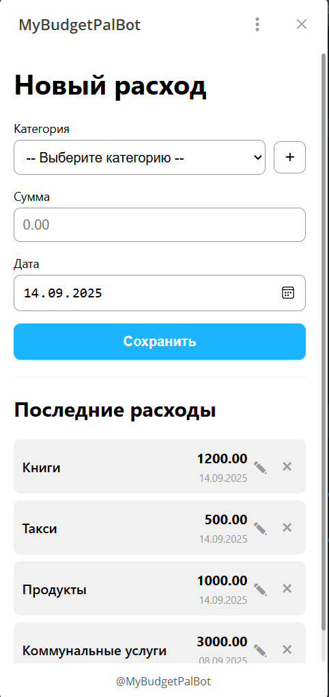

# MyBudgetPalBot: Telegram Mini App для учета финансов

<p align="center">
  
  
  
  
  
</p>
<p align="center">
  
  
  
  
</p>

---

**MyBudgetPalBot** — это современное full-stack приложение для учета личных финансов, реализованное в виде **Telegram Mini App (TMA)**. Проект демонстрирует гибридную архитектуру, где Python-бэкенд одновременно обслуживает Telegram-бота и предоставляет защищенное REST API для интерактивного веб-интерфейса.

<p align="center">

</p>

## ✨ Ключевые особенности

*   **Интерактивный UI/UX**: Полноценный веб-интерфейс внутри Telegram для удобного ввода, редактирования и просмотра расходов.
*   **Безопасность по умолчанию**: API защищено механизмом валидации `initData` от Telegram, что гарантирует аутентичность каждого запроса.
*   **Гибридный бэкенд**: Единое асинхронное приложение на `FastAPI` и `aiogram 3` разделяет общую логику и упрощает развертывание.
*   **Типобезопасная работа с БД**: `SQLModel` используется для строгой типизации моделей данных и предотвращения ошибок на уровне ORM.
*   **Готовность к развертыванию**: Приложение полностью контейнеризировано с помощью `Docker` и следует лучшим практикам multi-stage builds.

## 🏆 Философия качества кода

Этот проект разработан с упором на надежность, безопасность и поддерживаемость, что подтверждается использованием полного набора инструментов статического анализа и тестирования.

*   **Форматирование и Линтинг**: `Ruff` обеспечивает строгий и единый стиль кода во всем проекте.
*   **Строгая типизация**: `MyPy` используется в режиме `--strict` для гарантии типобезопасности на всех уровнях приложения.
*   **Безопасность**: `Bandit` и `pip-audit` интегрированы в CI для проактивного поиска уязвимостей в коде и зависимостях.
*   **Комплексное тестирование**:
    *   **Unit- и интеграционные тесты**: `Pytest` используется для покрытия основной бизнес-логики (>90% coverage).
    *   **Property-Based Testing**: `Hypothesis` применяется для стресс-тестирования API и утилит. Вместо проверки на заранее заданных примерах, `Hypothesis` генерирует сотни разнообразных входных данных, автоматически находя пограничные случаи, которые могли бы привести к ошибкам.

## 🛠️ Технологический стек

| Категория      | Технология                                                              |
|----------------|-------------------------------------------------------------------------|
| **Бэкенд**     | Python 3.11+, FastAPI, Aiogram 3, Uvicorn                               |
| **База данных**| SQLite, aiosqlite, SQLModel                                             |
| **Фронтенд**   | HTML5, CSS3, JavaScript (ES6+), Telegram Web App API                    |
| **Тестирование**| Pytest, pytest-asyncio, pytest-cov, Hypothesis                          |
| **Качество кода** | Ruff, MyPy, Bandit, pre-commit                                          |
| **Зависимости**  | Poetry                                                                  |
| **Развертывание**| Docker                                                                  |

## ⚙️ Установка и запуск

### Способ 1: Локальный запуск (с помощью Poetry)

1.  **Клонируйте репозиторий:**
    ```bash
    git clone https://github.com/Relayn/MyBudgetPalBot.git
    cd MyBudgetPalBot
    ```
2.  **Установите зависимости:** (требуется [Poetry](https://python-poetry.org/docs/#installation))
    ```bash
    poetry install
    ```
3.  **Настройте переменные окружения:**
    Скопируйте `.env.example` в `.env` и заполните его:
    ```dotenv
    BOT_TOKEN="ВАШ_ТЕЛЕГРАМ_БОТ_ТОКЕН"
    WEB_APP_URL="ВАШ_ПУБЛИЧНЫЙ_HTTPS_URL"
    ```
    *   `WEB_APP_URL`: Для локальной разработки рекомендуется использовать `ngrok` для создания HTTPS-тоннеля: `ngrok http 8000`.

4.  **Запустите приложение:**
    ```bash
    poetry run start
    ```

### Способ 2: Запуск через Docker

1.  **Клонируйте репозиторий и настройте `.env`** (см. шаги 1 и 3 выше).
2.  **Соберите и запустите Docker-контейнер:**
    ```bash
    # Собрать образ
    docker build -t my-budget-pal-bot .

    # Запустить контейнер
    docker run -d --name budget-bot -p 8000:8000 --env-file .env my-budget-pal-bot
    ```

## 🧪 Запуск тестов

Для запуска полного набора тестов и просмотра отчета о покрытии выполните:
```bash
poetry run pytest --cov=src/budget_bot
```

## 📂 Структура проекта

```
.
├── src/budget_bot/       # Основной исходный код приложения
│   ├── api/              # Логика FastAPI (роутеры, схемы)
│   ├── db/               # Модели данных, сессии, движок БД
│   ├── handlers/         # Обработчики aiogram
│   ├── utils/            # Вспомогательные утилиты (например, безопасность)
│   └── main.py           # Точка входа в приложение
├── tests/                # Автоматизированные тесты
│   ├── api/              # Тесты для API-эндпоинтов
│   └── ...
├── tma_frontend/         # Статические файлы фронтенда (HTML/CSS/JS)
├── .env.example          # Пример файла переменных окружения
├── Dockerfile            # Инструкции для сборки Docker-образа
├── pyproject.toml        # Файл конфигурации проекта и зависимостей (Poetry)
└── README.md             # Этот файл
```

## 📄 Лицензия

Проект распространяется под лицензией MIT. См. файл `LICENSE` для подробностей.
